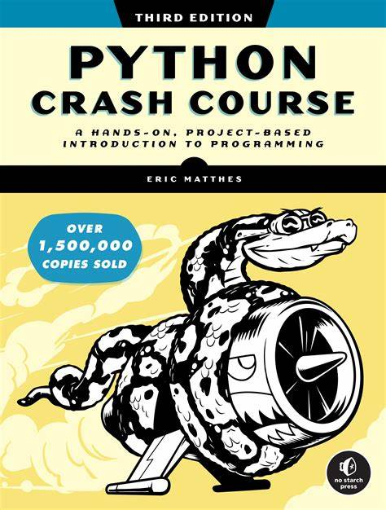

# Python-Crash-Course-Third-Edition
All work completed from "Python Crash Course 3rd Edition" textbook from No Starch Press

<ol>
    <li>Basics</li>
    <ol>
        <li>Getting Started</li>
        <li>Variables and Simple Data Types</li>
        <li>Introducing Lists</li>
        <li>If Statements</li>
        <li>Dictionaries</li>
        <li>User Input and While Loops</li>
        <li>Functions</li>
        <li>Classes</li>
        <li>Files and Exceptions</li>
        <li>Testing Your Code</li>
    </ol>

</ol>